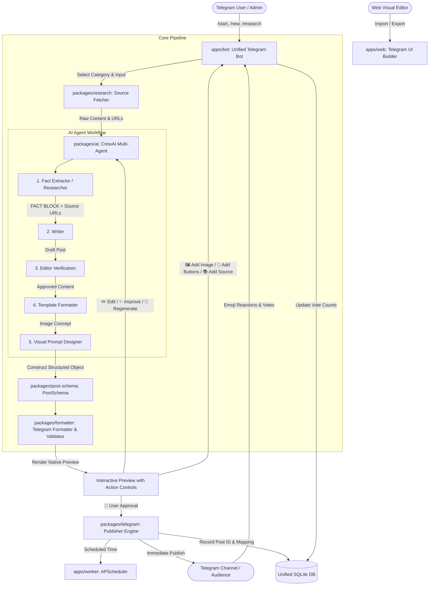

# Heyaaashu Studio — System Architecture & Integration Blueprint

> **Private AI + Tech + Jobs + Career Content Operating System for Telegram (@Heyaashu_bot)**

---

## 1. Executive Summary

Heyaaashu Studio combines three specialized open-source codebases into a unified, enterprise-grade content operating system:

1. **PostingPost** (`apps/telegram-publisher`): Telegram publishing engine, post construction, media handling, inline button matrix, reactions/voting analytics, scheduling, and history.
2. **Telegram UI Builder** (`apps/message-builder`): React/Vite visual Telegram message designer, HTML/MarkdownV2 preview, inline keyboard flow builder, template system, and code/JSON export.
3. **AI Content Bot** (`apps/ai-content`): Multi-agent pipeline (Analyst, Researcher/Fact Extractor, Writer, Editor, Formatter, Visual Designer) with multi-source collectors (RSS, Reddit, Web scraping, GitHub, Hugging Face, Telegram channels).

### Guiding Architectural Principles
- **Single Polling Receiver**: Exactly one Telegram update receiver will poll `@Heyaashu_bot`. Publishing and pipeline tasks run as internal headless modules/workers.
- **Strict Factual Integrity**: Fact extraction acts as ground truth. No hallucinations, no generic hype words, no invented dates/salaries, and explicit source attribution.
- **Common Post Schema**: A single structured contract (`PostSchema`) ties AI research, visual editing, formatting validation, multi-channel publishing, and persistence.
- **Progressive Modular Extraction**: Integrations remain initially runnable while reusable packages (`post-schema`, `formatter`, `research`, `ai`, `telegram`, `shared`) are extracted systematically without breaking working code.

---

## 2. Comprehensive Audit of Existing Applications

### Application Matrix

| Dimension | 1. PostingPost (`telegram-publisher`) | 2. Telegram UI Builder (`message-builder`) | 3. AI Content Bot (`ai-content`) |
| :--- | :--- | :--- | :--- |
| **Language & Runtime** | Python 3.10+, aiogram 3.4, APScheduler | TypeScript 5, React 18, Vite 6, Node.js 18+ | Python 3.10+, CrewAI, aiogram 3.14, Telethon |
| **Primary Role** | Post creation FSM, scheduling, channel publishing, voting | Visual message builder, rich preview, flow editor, export | Web/RSS/Reddit/TG research, multi-agent writing & digest |
| **Telegram Role** | Interactive polling bot (`dp.start_polling`) | Client-side visual simulator & code generator | Interactive polling bot + Telethon scraper userbot |
| **Storage / DB** | SQLite (`posting_bot.db`) via raw SQL | LocalStorage / Zustand store (+ optional Supabase) | SQLite (`posts.db`) via raw SQL helper |

---

### Detailed Inspection Breakdown

#### 1. Existing Telegram Functionality
- **PostingPost**:
  - `handlers/start.py`: Main menu router (`/start`).
  - `handlers/channels.py`: `/channels` command, admin authorization checks (`get_chat_member`), channel listing, and unlinking.
  - `handlers/post_creator.py`: Multi-step FSM (`waiting_channel`, `waiting_content`, `preview_action`, `editing_text`, `adding_buttons`, `adding_reactions`, `scheduling_date`). Supports `bot.copy_message` and native media types.
  - `handlers/history.py` & `handlers/scheduler.py`: History inspection, scheduled job management, live voting callback handler (`vote:post_id:emoji`).
  - `services/post_service.py`: `send_post()` multi-media dispatcher (text, photo, video, document, audio, voice, video_note, animation, sticker).
- **Telegram UI Builder**:
  - Simulates Telegram message bubble with dark/light mode, timestamp, verified badge, and multi-row inline keyboards (`url`, `callback_data`, `web_app`, `switch_inline_query`).
  - Export generators for aiogram 3.x, grammY, Telegraf, Python Telegram Bot, and Telegram JSON Schema.
- **AI Content Bot**:
  - `bot/telegram_bot.py`: aiogram Bot & Dispatcher instance creation.
  - `bot/handlers.py`: Digest approval flow (10 curated topics with buttons), 1-click variant approval (`✅ Вар. 1`), custom edit FSM, `/start`, `/run`, `/status`.
  - `parsers/telegram_userbot.py` & `auth_userbot.py`: Telethon client for scraping public and private source channels, downloading media files, and bypassing bot rate limits.

#### 2. Existing Formatting Functionality
- **PostingPost**:
  - Defaults to `HTML` (`DefaultBotProperties(parse_mode=ParseMode.HTML)`).
  - `services/table_service.py`: Generates monospace ASCII / Unicode boxed tables.
- **Telegram UI Builder**:
  - Supports `HTML`, `MarkdownV2`, and `Markdown`.
  - Bidirectional parser & sanitizer using DOMPurify.
  - Enforces Telegram limits (4096 chars text, 1024 chars caption, 64-byte callback_data, max 8 buttons/row).
- **AI Content Bot**:
  - `_html_to_entities()` converts HTML markup (`<b>`, `<i>`, `<u>`, `<s>`, `<a>`, `<code>`, `<pre>`) into native Telegram `MessageEntity` objects.
  - Formatting rules embedded in CrewAI system prompts (clean headers, factual bullet points, no marketing buzzwords).

#### 3. Existing UI Builder Functionality
- **PostingPost**: Text-based Telegram inline keyboard flow with edit, add buttons, add reactions, preview, and schedule options.
- **Telegram UI Builder**: Full-fledged visual workbench with:
  - Drag-and-drop inline keyboard editor (`@dnd-kit`).
  - Real-time WYSIWYG preview canvas (`CenterCanvas.tsx`).
  - Button property inspector (`SidebarRight.tsx`).
  - Multi-message flow diagram (`ReactFlow` in `TemplateFlowDiagram.tsx`).
  - Template catalog (Welcome flows, Support, Feedback, Commerce).
- **AI Content Bot**: Interactive topic digest menu in Telegram chat.

#### 4. Existing AI & Research Pipeline
- **AI Content Bot**:
  - **Collectors (`parsers/source_fetcher.py`)**:
    - Telegram channels (Telethon + HTTP web preview fallback `t.me/s/...`).
    - RSS Feeds (`feedparser` with recency filtering).
    - Reddit (`/r/{subreddit}/new.json` public JSON).
    - Web scraping (TLDR AI, The Rundown, Ben's Bites via BeautifulSoup4).
    - Product Hunt AI trending scraper.
    - GitHub Trending Topics API.
    - Hugging Face daily papers and trending models API.
  - **Spam Filtering (`filter_ads`)**: Keyword/regex ad and promotional filter.
  - **Multi-Agent Pipeline (`agents/crew.py` & `agents/digest_crew.py`)**:
    - *Analyst (DigestCrew)*: Aggregates raw posts and produces top trending topics grouped into category taxonomies.
    - *Researcher / Fact Extractor*: Extracts numbers, benchmarks, versions, URLs into a structured `FACT BLOCK`.
    - *Writer*: Writes channel post strictly from the `FACT BLOCK`.
    - *Editor*: Cross-checks draft against facts, enforcing non-opinionated factual tone.
    - *RhythmChecker / Formatter*: Formats emojis, line breaks, bolding, blockquotes.
    - *VisualPromptDesigner*: Generates image generation prompt (Midjourney/Flux style concept).
  - **LLM Engine**: Multi-provider support via LiteLLM/CrewAI (`openrouter`, `deepseek`, `ofoxai`, `anthropic`, `openai`).

#### 5. Existing Dependencies
- **PostingPost**: `aiogram>=3.4.0`, `apscheduler>=3.10.0`, `pydantic-settings>=2.0.0`, `python-dotenv>=1.0.0`, `tzlocal>=5.0`.
- **Telegram UI Builder**: React 18, TypeScript 5, Vite 6, TailwindCSS 3, `@radix-ui/*`, `lucide-react`, `zustand`, `reactflow`, `@dnd-kit/*`, `dompurify`, `js-yaml`, `@supabase/supabase-js`.
- **AI Content Bot**: `anthropic>=0.40.0`, `openai>=1.0.0`, `crewai>=0.80.0`, `aiogram>=3.14.0`, `apscheduler>=3.10.0`, `httpx>=0.27.0`, `beautifulsoup4>=4.12.0`, `python-dotenv>=1.0.0`, `lxml>=5.0.0`, `telethon>=1.36.0`, `feedparser>=6.0.0`.

#### 6. Existing Environment Variables
- `TELEGRAM_BOT_TOKEN` / `BOT_TOKEN`: Bot token for @Heyaashu_bot.
- `ADMIN_CHAT_ID`: Telegram user ID of admin.
- `TARGET_CHANNEL_ID`: Channel ID / username for published posts.
- `TELEGRAM_API_ID`, `TELEGRAM_API_HASH`, `TELEGRAM_PHONE`: Telethon userbot credentials.
- `LLM_PROVIDER`, `OPENROUTER_API_KEY`, `DEEPSEEK_API_KEY`, `ANTHROPIC_API_KEY`, `OPENAI_API_KEY`, `LLM_MODEL_NAME`, `LLM_DAILY_BUDGET_USD`.
- `LANGUAGE`, `CONTENT_LANGUAGE`: Interface & content generation language (`en` / `ru`).
- `DATABASE_PATH`: SQLite database path.

#### 7. Existing Entry Points
- `apps/telegram-publisher/main.py`: Polling bot entry point.
- `apps/ai-content/main.py`: Polling bot + scheduler entry point.
- `apps/ai-content/scheduler.py`: Pipeline job trigger.
- `apps/ai-content/auth_userbot.py`: Telethon login CLI.
- `apps/message-builder/index.html` & `src/main.tsx`: Web SPA entry point.

#### 8. Existing Database / Storage
- `posting_bot.db`: `users`, `channels`, `user_channels`, `posts`, `sent_posts`, `votes`.
- `posts.db`: `sources`, `raw_posts`, `digests`, `posts`.

#### 9. Existing Reusable Modules
- `apps/telegram-publisher/services/post_service.py` -> Candidate for `packages/telegram/publisher.py`.
- `apps/telegram-publisher/services/scheduler_service.py` -> Candidate for `packages/telegram/scheduler.py`.
- `apps/ai-content/parsers/source_fetcher.py` -> Candidate for `packages/research/fetchers/`.
- `apps/ai-content/agents/crew.py` -> Candidate for `packages/ai/crew.py`.
- `apps/message-builder/src/lib/validation.ts` -> Candidate for `packages/formatter/validators.ts`.

---

## 3. Target System Architecture

```
heyaaashu-studio/
├── apps/
│   ├── bot/                 # Single Telegram polling receiver (@Heyaashu_bot)
│   ├── web/                 # Web Visual UI Builder (React/Vite message designer)
│   └── worker/              # Headless background worker (scheduled research & publishing)
│
├── packages/
│   ├── post-schema/         # Canonical Post Schema (JSON Schema + Pydantic models)
│   ├── formatter/           # HTML/MarkdownV2 parsing, entity mapping & constraint validation
│   ├── research/            # Multi-source scrapers (RSS, Reddit, Web, GitHub, HF, TG)
│   ├── ai/                  # Multi-agent pipelines (Fact extraction, Writer, Editor, Formatter)
│   ├── telegram/            # Publisher engine, inline keyboard matrix builder, media sender
│   └── shared/              # Unified database models, config loader, logging, security
│
├── integrations/            # Preserved original codebases during migration
│   ├── postingpost/
│   ├── telegram-ui-builder/
│   └── ai-content-bot/
│
└── test-data/
    └── test-post.json       # Test fixture for CI/CD & local verification
```

---

## 4. Integration Boundaries & Data Flow



---

## 5. Canonical Post Schema Specification

Every post in Heyaaashu Studio adheres to the following unified schema:

```json
{
  "$schema": "http://json-schema.org/draft-07/schema#",
  "title": "HeyaaashuStudioPost",
  "type": "object",
  "required": [
    "content_type",
    "title",
    "body",
    "parse_mode",
    "buttons"
  ],
  "properties": {
    "content_type": {
      "type": "string",
      "enum": [
        "ai_news",
        "job",
        "internship",
        "hackathon",
        "ai_tool",
        "career",
        "resource"
      ]
    },
    "title": { "type": "string" },
    "body": { "type": "string" },
    "parse_mode": {
      "type": "string",
      "enum": ["HTML", "MarkdownV2"],
      "default": "HTML"
    },
    "source": {
      "oneOf": [
        { "type": "string", "format": "uri" },
        {
          "type": "object",
          "required": ["url"],
          "properties": {
            "title": { "type": "string" },
            "url": { "type": "string", "format": "uri" }
          }
        },
        { "type": "null" }
      ]
    },
    "media": {
      "type": "array",
      "items": {
        "type": "object",
        "required": ["type", "url_or_path"],
        "properties": {
          "type": {
            "type": "string",
            "enum": ["photo", "video", "document", "animation"]
          },
          "url_or_path": { "type": "string" },
          "file_id": { "type": "string" }
        }
      },
      "default": []
    },
    "buttons": {
      "type": "array",
      "items": {
        "type": "object",
        "required": ["text", "url"],
        "properties": {
          "text": { "type": "string" },
          "url": { "type": "string", "format": "uri" }
        }
      },
      "default": []
    },
    "hashtags": {
      "type": "array",
      "items": { "type": "string" },
      "default": []
    },
    "keywords": {
      "type": "array",
      "items": { "type": "string" },
      "default": []
    },
    "image_prompt": {
      "type": ["string", "null"],
      "default": null
    },
    "verification": {
      "type": "object",
      "properties": {
        "status": {
          "type": "string",
          "enum": ["verified", "needs_verification", "unverified"],
          "default": "verified"
        },
        "sources": {
          "type": "array",
          "items": { "type": "string" },
          "default": []
        }
      },
      "default": { "status": "verified", "sources": [] }
    }
  }
}
```

---

## 6. Content Templates Taxonomy

### 🚨 AI News Template
```text
🚨 AI NEWS

<b>{HEADLINE}</b>

{What happened?}

⚡ <b>KEY TAKEAWAYS</b>
• {Key point 1}
• {Key point 2}

💡 <b>WHY IT MATTERS</b>
{Significance and impact}

📚 <b>SOURCE</b>
[🔗 Read Source]
```

### 💼 Job Alert Template
```text
💼 <b>JOB ALERT</b>

<b>{ROLE}</b>

🏢 <b>Company:</b> {Company Name}
📍 <b>Location:</b> {Location / Remote}
🎓 <b>Eligibility:</b> {Experience / Degree}
💰 <b>Compensation:</b> {Salary / Range}
📅 <b>Deadline:</b> {Application Deadline}

<b>About the Role:</b>
{Brief description & key requirements}

[💼 APPLY NOW]
```

### 🎓 Internship Template
```text
🎓 <b>INTERNSHIP ALERT</b>

<b>{ROLE}</b>

🏢 <b>Company:</b> {Company Name}
📍 <b>Location:</b> {Location / Remote}
🎓 <b>Eligibility:</b> {Target Batch / Branch}
💰 <b>Stipend:</b> {Monthly Stipend}
📅 <b>Deadline:</b> {Application Deadline}

<b>Overview:</b>
{Brief description}

[🚀 APPLY NOW]
```

### 🏆 Hackathon Template
```text
🏆 <b>HACKATHON</b>

<b>{NAME}</b>

💰 <b>Prize Pool:</b> {Prize Amount}
📅 <b>Deadline:</b> {Registration Deadline}
👥 <b>Team Size:</b> {Team Limits}
🌐 <b>Location:</b> {Online / On-site}

🔥 <b>What to Build:</b>
{Tracks & Theme summary}

[🚀 REGISTER NOW]
```

### 🛠 AI Tool Template
```text
🛠 <b>AI TOOL OF THE DAY</b>

<b>{NAME}</b>

{What it does - 1-2 punchy sentences}

🔥 <b>Best For:</b> {Target audience}
💰 <b>Pricing:</b> {Free / Freemium / Paid}

[🚀 TRY IT OUT]
```

---

## 7. Migration Plan (Phases 1 to 9)

```mermaid
gantt
    title Heyaaashu Studio Migration Roadmap
    dateFormat  YYYY-MM-DD
    section Core Setup
    Phase 1: Coexistence & Architectural Audit           :done,    p1, 2026-09-01, 1d
    Phase 2: Post Schema & Formatter Engine              :active,  p2, after p1, 1d
    section AI & UI Integration
    Phase 3: Connect AI Pipeline to Post Schema          :         p3, after p2, 1d
    Phase 4: Visual UI Builder & Schema Interop          :         p4, after p3, 1d
    Phase 5: Unified Telegram Publisher Engine           :         p5, after p4, 1d
    section Telegram UX & Polish
    Phase 6: Single Bot UX (/new, /research, /drafts)    :         p6, after p5, 1d
    Phase 7: Image Concept & Asset Handling              :         p7, after p6, 1d
    Phase 8: Unified Drafts, History & Voting Analytics  :         p8, after p7, 1d
    Phase 9: Background Worker & APScheduler             :         p9, after p8, 1d
```

### Step-by-Step Milestones
1. **Phase 1 (Complete)**: Comprehensive audit, `ARCHITECTURE.md`, strict `.gitignore` rules, verifying single-bot receiver policy.
2. **Phase 2 (Immediate next)**: Canonical `PostSchema` Pydantic models, robust HTML/MarkdownV2 formatter, and end-to-end `test-post.json` test suite.
3. **Phase 3**: Upgrade CrewAI outputs in `packages/ai` to emit valid `PostSchema` objects with strict factual verification.
4. **Phase 4**: Add schema import/export and preview synchronization in `apps/message-builder`.
5. **Phase 5**: Refactor `post_service.py` into headless `packages/telegram` client supporting direct dispatch from `PostSchema`.
6. **Phase 6**: Deploy the unified `@Heyaashu_bot` router with `/new` category picker, auto-extraction, and interactive preview controls.
7. **Phase 7**: Integrate optional image prompt generation and media attachments.
8. **Phase 8**: Unify draft persistence, history logs, and reaction callback listeners in `packages/shared/db.py`.
9. **Phase 9**: Integrate automated digest and publishing triggers via `apps/worker`.

---

## 8. Security & Environment Governance

- **Credentials Protection**: Never commit bot tokens, API keys (OpenAI, Anthropic, DeepSeek, OpenRouter), Telethon session files (`*.session`), or SQLite databases.
- **Centralized Configuration**: All sub-packages consume configuration through a centralized `packages/shared/config.py` module backed by `pydantic-settings`.
- **Validation Before Dispatch**: All outgoing messages pass through `packages/formatter` to guarantee character limits and escape compliance before reaching Telegram servers.
